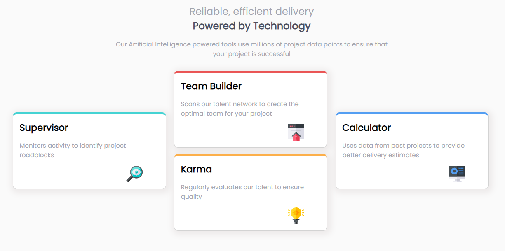

# Base Apparel Preview component with HTML & CSS

This is a solution to the [Four card Feature section challenge on Frontend Mentor](https://www.frontendmentor.io/challenges/four-card-feature-section-weK1eFYK). Frontend Mentor challenges help you improve your coding skills by building realistic projects.

### The challenge

- Build out the project to the designs provided.

### Links

- [Click to play with the Live site](https://jcsmileyjr.github.io/Four-Card-Feature/)
- [Click to read the blog post](https://dev.to/jcsmileyjr/frontend-challenge-10-four-card-feature-4cj6)

### Built with

- Semantic HTML5 markup
- CSS custom properties
- Flex-box
- Mobile-first workflow

## Author

- Website - [JC Smiley](https://www.jcsmileyjr.com)
- Frontend Mentor - [@jcsmileyjr](https://www.frontendmentor.io/profile/jcsmileyjr)
- Twitter - [@JCSmiley4](https://twitter.com/JCSmiley4)

